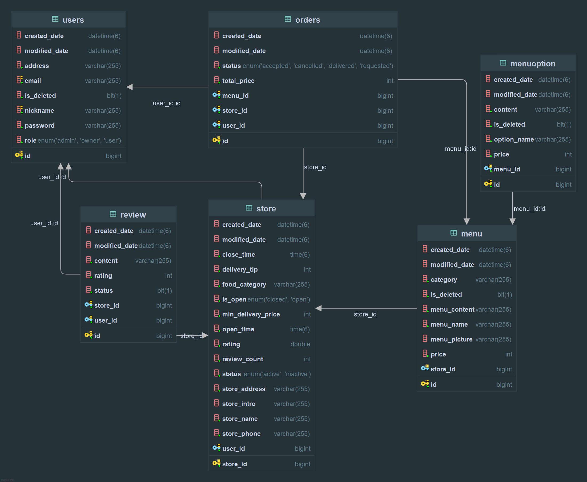

# 배달 어플 - Spring Boot 팀 프로젝트

---

## 프로젝트 개요

- 사용자가 회원가입, 로그인하여 배달 주문을 할 수 있는 웹 서비스
- Admin과 Owner 시스템을 통해 매장 관리, 메뉴 등록이 가능
- JWT 토큰 인증과 Redis를 통한 토큰 관리(로그아웃, 재발급) 구현
- Swagger를 통한 API 문서 자동화
- 프론트앤드 제작

## 팀원 별 역할

| 이름  | 담당                  |
|-----|---------------------|
| 기 원 | 사용자 인증인가 및 회원 로직 전반 |
| 최 혁 | 주문 관련 로직 전반         |
| 정승원 | 매장 관련 로직 전반         |
| 양재호 | 메뉴 관련 로직 전반         |
| 김희준 | 리뷰 관련 로직 전반         |


## 주요 기능

- 회원가입 / 로그인, 로그아웃 / 소셜 로그인
- 사용자 위치 기반 반응형 로고
- 사용자 프로필 조회 및 수정
- 비밀번호 변경
- 사업자 권한 신청
- 사용자 강제 탈퇴(admin 권한)
- 토큰 재발급
- 메뉴 조회 시 '일부 단어' 조회 기능
- 메뉴 옵션 기능

## 기술 스택

| 범위 | 기술 |
|:---|:---|
| Language | Java 17 |
| Framework | Spring Boot 3.4.4 |
| ORM | Spring Data JPA |
| Database | MySQL, H2 (Test용) |
| Cache | Redis |
| Security | Spring Security, JWT (io.jsonwebtoken) |
| API Docs | Swagger (springdoc-openapi) |
| Build Tool | Gradle |
| Validation | Hibernate Validator (JSR-380) |
| Dependency Injection | Lombok |
| Test | JUnit 5, Mockito, Fixture Monkey, H2 |
| Code Quality | Checkstyle (네이버 코드 커버리지 기준) |
| Version Control | Git, GitHub |
| Environment Variables | dotenv-java (io.github.cdimascio) |

---

## 테스트

- 목표 커버리지 30% -> 달성률: **32%**
- Jacoco를 이용해 커버리지 리포트 생성 및 관리


## 프로젝트 구조
```
com.example.delivery_app
├── common              # 공통 모듈 (JWT, 예외, DTO)
├── api.region          # 외부 API 설정 (소셜로그인, 사용자 위치 기반 정보)
├── domain
│   ├── menu            # 메뉴 도메인 (00% 클래스, 00% 줄 테스트)
│   ├── order           # 주문 도메인 (100% 클래스, 96% 줄 테스트)
│   ├── review          # 리뷰 도메인 (00% 클래스, 00% 줄 테스트)
│   ├── store           # 가게 도메인 (00% 클래스, 00% 줄 테스트)
│   └── user            # 주문 도메인 (72% 클래스, 76% 줄 테스트)
└── DeliveryAppApplication.java
```

- `controller/`: API 진입 지점
- `service/`: 비즈니스 로직
- `domain/`: Entity + Repository
- `dto/`: 요청/응답 DTO
- `config/`: Security, Swagger 등 설정
- `exception/`: 전역 예외 처리

## API 명세

http://localhost:8080/swagger-ui/index.html#/

[API.json](API.json)

## ERD




## 코드 스타일

- 네이버 Java 코드 스타일 + `.editorconfig`
- 줄바꿈: LF 통일

## 공통 응답 및 예외처리

### CommonResponseDto (공통 응답 DTO)

- 예외/성공 공통 응답 DTO 입니다.
- `code` 필드는 커스텀코드가 아니므로, 추후 삭제 가능성이 있습니다.
- 정적 팩토리 메서드 패턴을 적용하여 가독성 있게 생성할 수 있게 했습니다.

### ResponseCode (공통 코드 클래스)

- 예외/성공 코드의 부모 클래스입니다.
  `(ex. OrderErrorCode, OrderSuccessCode..)`

### CustomException (커스텀 예외 클래스)

- `RuntimeException`을 상속받은 커스텀 예외 클래스
- 도메인 별, 예외코드 필드(`ResponseCode`)를 갖고 있습니다.

### GlobalExceptionHandler (전역 예외 핸들러 클래스)

- 기본 응답형식은 `ResponseEntity<CommonResponseDto<Void>>` 형태로 합니다.
- `Void`인 이유는 예외의 경우, 예외발생시 전달 데이터가 없기 때문입니다.
- `Service Layer`에서 `CustomException` 생성자를 통해 `도메인 ErrorCode`를 넘겨 반환합니다.
